```mermaid
flowchart LR
    subgraph Planned["Planned (DEVELOPMENT_PLAN.md)"]
        p1["auth.two_factor ❌"]
        p2["auth.validate ✅"]
        p3["api.rate_limit ❌"]
        p4["api.routes ✅"]
    end

    subgraph Implemented["Implemented (CODE_MAP.json)"]
        i1["auth.validate ✅"]
        i2["api.routes ✅"]
        i3["utils.logger ⚠️"]
        i4["db.cache ⚠️"]
    end

    p2 -.- i1
    p4 -.- i2

    style p1 fill:#ff6b6b,stroke:#c92a2a,color:#fff
    style p3 fill:#ff6b6b,stroke:#c92a2a,color:#fff
    style i3 fill:#ffd93d,stroke:#f59f00
    style i4 fill:#ffd93d,stroke:#f59f00
    style p2 fill:#40c057,stroke:#2f9e44,color:#fff
    style p4 fill:#40c057,stroke:#2f9e44,color:#fff
    style i1 fill:#40c057,stroke:#2f9e44,color:#fff
    style i2 fill:#40c057,stroke:#2f9e44,color:#fff
```

# CodeMap

**Know what breaks before you break it.**


CodeMap analyzes your Python codebase and tells you exactly what will be affected when you change something. No more "I didn't know that would break."

---

## See Your Code Like Never Before

This is what CodeMap generates from a real Flask application:


---

## Impact Analysis: What Happens If I Change This?

**You ask:** `codemap impact core.auth.jwt.verify_token`

**CodeMap shows you:**


```
Risk Score: 78/100 (HIGH)
Reason: Core authentication function with 17 total dependents across 8 files
```

---

## Quick Start

```bash
# Install
pip install codemap

# Analyze your project
cd your-python-project
codemap analyze

# See what breaks if you touch something
codemap impact core.auth.jwt.verify_token

# Generate architecture diagram
codemap graph -o architecture.mermaid
```

---

## Real CLI Output

```bash
$ codemap impact auth.validate_user --depth 2

╔══════════════════════════════════════════════════════════════════╗
║  IMPACT ANALYSIS: auth.validate_user                             ║
╠══════════════════════════════════════════════════════════════════╣
║  Risk Score: 72/100 ████████████████████░░░░░░░░ HIGH            ║
╚══════════════════════════════════════════════════════════════════╝

📍 DIRECT DEPENDENTS (3 functions in 2 files)
   ├── api.routes.login_endpoint        api/routes.py:45
   ├── api.routes.register_endpoint     api/routes.py:78
   └── cli.commands.auth_command        cli/commands.py:23

🔗 TRANSITIVE DEPENDENTS (7 functions in 4 files)
   ├── api.middleware.auth_required     api/middleware.py:12
   ├── api.routes.protected_route       api/routes.py:112
   ├── tests.test_auth.test_login       tests/test_auth.py:34
   └── ... and 4 more

🧪 SUGGESTED TESTS
   pytest tests/test_auth.py tests/api/test_routes.py -v

📊 BLAST RADIUS
   Files affected:  6 / 24  (25%)
   Functions:      10 / 89  (11%)
   Lines of code: ~450
```

---

## Function-Level Dependency View

Zoom into any module to see function-level dependencies:

```mermaid
flowchart TD
    subgraph auth.py["auth.py - Authentication Module"]
        validate["validate_user()
        ―――――――――――――
        Validates credentials
        against database"]

        hash["hash_password()
        ―――――――――――――
        Argon2 hashing
        with salt"]

        verify["verify_password()
        ―――――――――――――
        Constant-time
        comparison"]

        token["create_token()
        ―――――――――――――
        JWT with 24h
        expiration"]

        refresh["refresh_token()
        ―――――――――――――
        Extends session
        if valid"]
    end

    subgraph db.py["db.py - Database Layer"]
        get_user["get_user_by_email()"]
        update_user["update_last_login()"]
    end

    subgraph external["External"]
        argon2["argon2-cffi"]
        pyjwt["PyJWT"]
    end

    validate --> verify --> hash
    validate --> get_user
    validate --> update_user
    token --> pyjwt
    hash --> argon2
    refresh --> token

    style validate fill:#ff6b6b,stroke:#c92a2a,stroke-width:3px,color:#fff
    style hash fill:#228be6,stroke:#1864ab,color:#fff
    style verify fill:#228be6,stroke:#1864ab,color:#fff
    style token fill:#40c057,stroke:#2f9e44,color:#fff
    style refresh fill:#40c057,stroke:#2f9e44,color:#fff
```



---

## Features

| Feature | What It Does |
|---------|--------------|
| **Impact Analysis** | Shows exactly what breaks when you change something |
| **Dependency Graphs** | Beautiful Mermaid diagrams at module or function level |
| **Risk Scoring** | 0-100 score based on blast radius and test coverage |
| **DevPlan Integration** | Links code symbols to development plan tasks |
| **Drift Detection** | Finds code that wasn't in the plan (scope creep!) |
| **Git Hooks** | Auto-analyze on every commit |
| **Fast** | < 30 seconds for 50k LOC codebases |

---

## How It Works


---

## Installation

```bash
# From PyPI (coming soon)
pip install codemap

# From source
git clone https://github.com/your-username/codemap.git
cd codemap
pip install -e ".[dev]"
```

**Requirements:** Python 3.11+

---

## CLI Commands

```bash
codemap analyze        # Analyze codebase, generate CODE_MAP.json
codemap impact <sym>   # Show impact of changing a symbol
codemap graph          # Generate Mermaid dependency diagrams
codemap sync           # Link DevPlan tasks to code
codemap drift          # Detect planned vs implemented differences
codemap install-hooks  # Add git hooks for auto-analysis
```

---

## Configuration

```toml
# .codemap.toml or [tool.codemap] in pyproject.toml
[tool.codemap]
source_dir = "src"
output_dir = ".codemap"
exclude_patterns = ["__pycache__", ".venv", "tests"]
include_tests = false
diagram_direction = "TB"  # TB, LR, BT, RL
```

---

## DevPlan Integration

Track planned vs actual implementation:

```bash
codemap drift --devplan DEVELOPMENT_PLAN.md
```



```
DRIFT REPORT
============
✅ Implemented as planned:  42 symbols
❌ Missing (planned):        3 symbols  ← auth.two_factor, api.rate_limit, ...
⚠️  Unplanned (scope creep):  7 symbols  ← utils.logger, db.cache, ...
```

---

## Development

```bash
# Setup
python3 -m venv .venv && source .venv/bin/activate
pip install -e ".[dev]"

# Test
pytest tests/ -v --cov=codemap

# Lint
ruff check codemap tests && mypy codemap
```

---

## Roadmap

- [x] AST analysis with pyan3
- [x] NetworkX dependency graph
- [x] Mermaid diagram generation
- [x] Impact analysis with risk scoring
- [x] DevPlan integration
- [x] Drift detection
- [ ] Interactive web explorer (pyvis)
- [ ] VSCode extension
- [ ] CI/CD PR impact comments
- [ ] Multi-language support

---

## License

MIT - Do whatever you want with it.

---

<p align="center">
  <b>Stop guessing. Start knowing.</b><br><br>
  <code>pip install codemap</code>
</p>
