# CodeMap

**Know what breaks before you break it.**

[](https://github.com/mmorris35/CodeMap/actions)
[](https://github.com/mmorris35/CodeMap/actions/workflows/deploy.yml)
[](https://github.com/mmorris35/CodeMap)
[](https://www.python.org/downloads/)
[](https://pypi.org/project/codemap/)
[](LICENSE)

CodeMap analyzes your Python codebase and tells you exactly what will be affected when you change something. No more "I didn't know that would break."

---

## Claude Code Installation

> **For Claude Code Users**: Install the CodeMap MCP server with one command:
>
> ```bash
> npx github:mmorris35/CodeMap
> ```
>
> Then **restart Claude Code** to activate the MCP server. You can now ask Claude Code to analyze Python projects and check dependencies before making changes!

---

## See Your Code Like Never Before

This is what CodeMap generates from a real Flask application:


---

## Impact Analysis: What Happens If I Change This?

**You ask:** `codemap impact core.auth.jwt.verify_token`

**CodeMap shows you:**


```
Risk Score: 78/100 (HIGH)
Reason: Core authentication function with 17 total dependents across 8 files
```

---

## Quick Start

```bash
# Install
pip install codemap

# Analyze your project
cd your-python-project
codemap analyze

# See what breaks if you touch something
codemap impact core.auth.jwt.verify_token

# Generate architecture diagram
codemap graph -o architecture.mermaid
```

---

## Real CLI Output

```bash
$ codemap impact auth.validate_user --depth 2

╔══════════════════════════════════════════════════════════════════╗
║  IMPACT ANALYSIS: auth.validate_user                             ║
╠══════════════════════════════════════════════════════════════════╣
║  Risk Score: 72/100 ████████████████████░░░░░░░░ HIGH            ║
╚══════════════════════════════════════════════════════════════════╝

📍 DIRECT DEPENDENTS (3 functions in 2 files)
   ├── api.routes.login_endpoint        api/routes.py:45
   ├── api.routes.register_endpoint     api/routes.py:78
   └── cli.commands.auth_command        cli/commands.py:23

🔗 TRANSITIVE DEPENDENTS (7 functions in 4 files)
   ├── api.middleware.auth_required     api/middleware.py:12
   ├── api.routes.protected_route       api/routes.py:112
   ├── tests.test_auth.test_login       tests/test_auth.py:34
   └── ... and 4 more

🧪 SUGGESTED TESTS
   pytest tests/test_auth.py tests/api/test_routes.py -v

📊 BLAST RADIUS
   Files affected:  6 / 24  (25%)
   Functions:      10 / 89  (11%)
   Lines of code: ~450
```

---

## Function-Level Dependency View

Zoom into any module to see function-level dependencies:

```mermaid
flowchart TD
    subgraph auth.py["auth.py - Authentication Module"]
        validate["validate_user()
        ―――――――――――――
        Validates credentials
        against database"]

        hash["hash_password()
        ―――――――――――――
        Argon2 hashing
        with salt"]

        verify["verify_password()
        ―――――――――――――
        Constant-time
        comparison"]

        token["create_token()
        ―――――――――――――
        JWT with 24h
        expiration"]

        refresh["refresh_token()
        ―――――――――――――
        Extends session
        if valid"]
    end

    subgraph db.py["db.py - Database Layer"]
        get_user["get_user_by_email()"]
        update_user["update_last_login()"]
    end

    subgraph external["External"]
        argon2["argon2-cffi"]
        pyjwt["PyJWT"]
    end

    validate --> verify --> hash
    validate --> get_user
    validate --> update_user
    token --> pyjwt
    hash --> argon2
    refresh --> token

    style validate fill:#ff6b6b,stroke:#c92a2a,stroke-width:3px,color:#fff
    style hash fill:#228be6,stroke:#1864ab,color:#fff
    style verify fill:#228be6,stroke:#1864ab,color:#fff
    style token fill:#40c057,stroke:#2f9e44,color:#fff
    style refresh fill:#40c057,stroke:#2f9e44,color:#fff
```



---

## Features

| Feature | What It Does |
|---------|--------------|
| **Impact Analysis** | Shows exactly what breaks when you change something |
| **Dependency Graphs** | Beautiful Mermaid diagrams at module or function level |
| **Risk Scoring** | 0-100 score based on blast radius and test coverage |
| **DevPlan Integration** | Links code symbols to development plan tasks |
| **Drift Detection** | Finds code that wasn't in the plan (scope creep!) |
| **Git Hooks** | Auto-analyze on every commit |
| **Fast** | < 30 seconds for 50k LOC codebases |
| **MCP Server** | Claude Code integration via Model Context Protocol |

---

## Claude Code Integration (MCP Server)

**The killer feature:** CodeMap gives Claude Code real-time dependency awareness. Before Claude modifies your code, it can check what will break.

Claude Code now has access to these tools for any Python project:

| Tool | What Claude Code Uses It For |
|------|------------------------------|
| `analyze_project(path)` | Analyze a Python project (run this first) |
| `get_dependents(symbol)` | "What functions call this?" before refactoring |
| `get_impact_report(symbol)` | Full blast radius analysis with risk score |
| `check_breaking_change(symbol, new_sig)` | "Will this signature change break callers?" |
| `get_architecture()` | High-level overview of module dependencies |

### How It Works


**All analysis happens locally.** Your code never leaves your machine.

### Example: Claude Code Using Impact Analysis

```
You: "Refactor validate_user() to be async"

Claude Code (internally):
  → Calls analyze_project(".") to build dependency graph
  → Calls get_impact_report("auth.validate_user")
  → Discovers 17 dependents, risk score: HIGH
  → Calls check_breaking_change with new async signature
  → Finds 5 direct callers need await

Claude Code: "This affects 17 functions. I'll update the 5 direct
callers to use await, then fix the transitive callers..."
```

### CLI Commands

The MCP server also works as a standalone CLI:

```bash
# Analyze a project
codemap-mcp analyze ./my-python-project

# List analyzed projects
codemap-mcp list

# Show project details
codemap-mcp show my-project --symbols
```

---

## How It Works


---

## Installation

### From PyPI (Recommended)

```bash
pip install codemap
```

### From Source (Development)

```bash
# Clone the repository
git clone https://github.com/your-username/codemap.git
cd codemap

# Create and activate virtual environment
python3 -m venv .venv
source .venv/bin/activate  # On Windows: .venv\Scripts\activate

# Install with development dependencies
pip install -e ".[dev]"

# Run tests to verify installation
pytest tests/ -v --cov=codemap
```

### Requirements

- **Python:** 3.11 or higher
- **OS:** Linux, macOS, or Windows
- **Dependencies:** All managed by pip (see pyproject.toml)

---

## CLI Commands

### analyze - Analyze Your Codebase

Generate CODE_MAP.json and architecture diagrams:

```bash
codemap analyze                                    # Analyze current directory
codemap analyze --source ./src --output .codemap   # Specify source and output
codemap analyze -e __pycache__ -e .venv             # Exclude patterns
codemap analyze --help                             # See all options
```

**Options:**
- `--source/-s PATH` - Source directory to analyze (default: `.`)
- `--output/-o PATH` - Output directory (default: `.codemap`)
- `--exclude/-e PATTERN` - Patterns to exclude (repeatable)

**Outputs:**
- `CODE_MAP.json` - Complete dependency graph in JSON format
- `ARCHITECTURE.mermaid` - Module-level architecture diagram

### impact - Analyze Impact of Changes

See what breaks when you change a symbol:

```bash
codemap impact auth.validate_user                  # Single symbol
codemap impact 'auth.*' 'db.*'                     # Multiple patterns
codemap impact auth.validate_user --depth 5        # Deeper analysis
codemap impact auth.validate_user --format json    # JSON output
```

**Options:**
- `SYMBOLS` - Qualified symbol names or glob patterns (required)
- `--depth/-d INT` - Traversal depth (default: 3)
- `--format/-f {text|json|mermaid}` - Output format (default: text)

**Output:**
- Risk score (0-100)
- Direct and transitive impacts
- Affected files
- Suggested tests to run

### graph - Generate Dependency Diagrams

Visualize code structure with Mermaid diagrams:

```bash
codemap graph                                       # Module-level diagram
codemap graph --level function --module auth        # Function-level in module
codemap graph -o architecture.mermaid               # Save to file
codemap graph --format dot -o graph.dot             # Convert to DOT format
```

**Options:**
- `--level/-l {module|function}` - Diagram detail level (default: module)
- `--module/-m NAME` - Focus on specific module (function level only)
- `--output/-o FILE` - Output file (default: stdout)
- `--format/-f {mermaid|dot}` - Output format (default: mermaid)

### sync - Link Development Plan to Code

Create bidirectional mapping between DEVELOPMENT_PLAN.md and code:

```bash
codemap sync --devplan DEVELOPMENT_PLAN.md          # Dry-run (show matches)
codemap sync --devplan DEVELOPMENT_PLAN.md --update-map  # Update CODE_MAP.json
```

**Options:**
- `--devplan/-d FILE` - Path to DEVELOPMENT_PLAN.md (required)
- `--update-map` - Write changes to CODE_MAP.json (default: dry-run)

**Output:**
- Match statistics (symbols linked to tasks)
- Confidence scores for each link

### drift - Detect Architecture Drift

Compare actual code to development plan:

```bash
codemap drift --devplan DEVELOPMENT_PLAN.md         # Markdown output
codemap drift --devplan DEVELOPMENT_PLAN.md -o DRIFT_REPORT.md
codemap drift --devplan DEVELOPMENT_PLAN.md --format json
```

**Options:**
- `--devplan/-d FILE` - Path to DEVELOPMENT_PLAN.md (required)
- `--output/-o FILE` - Output file (default: stdout)
- `--format/-f {markdown|json}` - Output format (default: markdown)

**Exit Codes:**
- `0` - No drift detected
- `1` - Drift detected (planned code not implemented or unplanned code exists)

### install-hooks - Setup Git Hooks

Automatically update CODE_MAP.json on commits:

```bash
codemap install-hooks --pre-commit                  # Pre-commit hook only
codemap install-hooks --pre-commit --post-commit    # Both hooks
codemap install-hooks --uninstall                   # Remove hooks
```

**Options:**
- `--pre-commit` - Install pre-commit hook
- `--post-commit` - Install post-commit hook
- `--uninstall` - Remove previously installed hooks

**Note:** Hooks are backed up before installation.

### Global Options

All commands support:

```bash
codemap -v, --verbose <command>   # Enable DEBUG logging
codemap -q, --quiet <command>     # Suppress INFO logging
codemap --version                 # Show version
codemap --help                    # Show general help
codemap <command> --help          # Show command-specific help
```

---

## Configuration

CodeMap reads configuration from `.codemap.toml` or the `[tool.codemap]` section in `pyproject.toml`.

### Configuration File Example

```toml
# .codemap.toml
[tool.codemap]
# Directory to analyze (default: current directory)
source_dir = "src"

# Directory for outputs (default: .codemap)
output_dir = ".codemap"

# Patterns to exclude from analysis (default: ["__pycache__", ".venv"])
exclude_patterns = ["__pycache__", ".venv", "tests", "*.egg-info"]

# Include test files in analysis (default: false)
include_tests = false

# Mermaid diagram direction: TB (top-bottom), LR (left-right), BT, RL
diagram_direction = "TB"
```

### Configuration Options

| Option | Type | Default | Description |
|--------|------|---------|-------------|
| `source_dir` | string | `.` | Root directory to analyze |
| `output_dir` | string | `.codemap` | Where to write CODE_MAP.json and diagrams |
| `exclude_patterns` | list | `["__pycache__", ".venv"]` | Patterns to skip (supports wildcards) |
| `include_tests` | bool | `false` | Include test files in analysis |
| `diagram_direction` | string | `TB` | Mermaid flowchart direction |

### Environment Variables

You can override configuration with environment variables:

```bash
# Set source directory
CODEMAP_SOURCE_DIR=./src codemap analyze

# Set output directory
CODEMAP_OUTPUT_DIR=./output codemap analyze

# Skip analysis (for CI/CD)
CODEMAP_SKIP=1 git commit -m "..."
```

---

## DevPlan Integration

### Linking Code to Your Development Plan

CodeMap integrates with your DevPlanBuilder `DEVELOPMENT_PLAN.md` file to track which code symbols implement which planned features.

**Workflow:**

1. **Generate Code Map**
   ```bash
   codemap analyze
   ```

2. **Link to Development Plan**
   ```bash
   codemap sync --devplan DEVELOPMENT_PLAN.md --update-map
   ```

3. **Detect Drift (Planned vs Implemented)**
   ```bash
   codemap drift --devplan DEVELOPMENT_PLAN.md
   ```

### What Gets Linked?

CodeMap automatically creates bidirectional links between:
- **Symbols in CODE_MAP.json** (functions, classes, modules)
- **Tasks in DEVELOPMENT_PLAN.md** (phases, tasks, subtasks)

Matching is based on:
- File names (e.g., `auth.py` matches task about "auth")
- Function names (e.g., `validate_user()` matches "validate user")
- Keyword overlap (confidence scoring)

### Example: Drift Detection

```bash
$ codemap drift --devplan DEVELOPMENT_PLAN.md

DRIFT REPORT
============
Generated: 2024-01-15 10:30:00 UTC
Codebase: 24 modules, 156 symbols

IMPLEMENTATION STATUS
✅ Implemented as planned:     42 symbols
   - auth.validate_user
   - db.connection_pool
   - api.routes (module)
   ... and 39 more

❌ Missing (planned but not coded):  3 symbols
   - auth.two_factor_auth
   - api.rate_limiter
   - analytics.event_tracking

⚠️  Unplanned (implemented but not in plan):  7 symbols
   - utils.logger
   - db.cache_manager
   - ... and 5 more

RISK ASSESSMENT
Medium Risk (Score: 32/100)
Reason: 3 planned features not yet implemented
```

### Integration Benefits

- **Traceability:** Know which code symbols implement which requirements
- **Completeness:** Track what you've built vs what was planned
- **Drift Detection:** Catch scope creep and missing implementations
- **Impact Analysis with Context:** See what tasks are affected by a code change

```mermaid
flowchart LR
    subgraph Planned["Planned (DEVELOPMENT_PLAN.md)"]
        p1["auth.two_factor ❌"]
        p2["auth.validate ✅"]
        p3["api.rate_limit ❌"]
        p4["api.routes ✅"]
    end

    subgraph Implemented["Implemented (CODE_MAP.json)"]
        i1["auth.validate ✅"]
        i2["api.routes ✅"]
        i3["utils.logger ⚠️"]
        i4["db.cache ⚠️"]
    end

    p2 -.- i1
    p4 -.- i2

    style p1 fill:#ff6b6b,stroke:#c92a2a,color:#fff
    style p3 fill:#ff6b6b,stroke:#c92a2a,color:#fff
    style i3 fill:#ffd93d,stroke:#f59f00
    style i4 fill:#ffd93d,stroke:#f59f00
    style p2 fill:#40c057,stroke:#2f9e44,color:#fff
    style p4 fill:#40c057,stroke:#2f9e44,color:#fff
    style i1 fill:#40c057,stroke:#2f9e44,color:#fff
    style i2 fill:#40c057,stroke:#2f9e44,color:#fff
```



```
DRIFT REPORT
============
✅ Implemented as planned:  42 symbols
❌ Missing (planned):        3 symbols  ← auth.two_factor, api.rate_limit, ...
⚠️  Unplanned (scope creep):  7 symbols  ← utils.logger, db.cache, ...
```

---

## Development

### Setting Up Your Development Environment

```bash
# Clone and navigate
git clone https://github.com/your-username/codemap.git
cd codemap

# Create virtual environment
python3 -m venv .venv
source .venv/bin/activate  # On Windows: .venv\Scripts\activate

# Install with dev dependencies
pip install -e ".[dev]"

# Verify installation
codemap --version
```

### Running Tests

```bash
# All tests with coverage
pytest tests/ -v --cov=codemap --cov-report=term-missing

# Specific test file
pytest tests/analyzer/test_graph.py -v

# Skip slow benchmarks
pytest tests/ -v -m "not benchmark"

# With HTML coverage report
pytest --cov=codemap --cov-report=html
# View: open htmlcov/index.html
```

### Code Quality Checks

```bash
# Linting with ruff
ruff check codemap tests

# Type checking with mypy
mypy codemap

# Code formatting (check only)
ruff format --check codemap tests

# Format code (fix in-place)
ruff format codemap tests

# Run all checks (required before commit)
ruff check codemap tests && \
ruff format --check codemap tests && \
mypy codemap && \
pytest tests/ -v --cov=codemap --cov-fail-under=80
```

### Project Structure

```
codemap/
├── codemap/                    # Main package
│   ├── __init__.py
│   ├── cli.py                  # Click CLI commands
│   ├── config.py               # Configuration loading
│   ├── logging_config.py       # Centralized logging
│   ├── analyzer/               # Code analysis
│   │   ├── pyan_wrapper.py     # AST analysis wrapper
│   │   ├── ast_visitor.py      # Custom AST visiting
│   │   ├── symbols.py          # Symbol representation
│   │   ├── graph.py            # Dependency graph
│   │   └── impact.py           # Impact analysis
│   ├── output/                 # Output generation
│   │   ├── mermaid.py          # Diagram generation
│   │   ├── code_map.py         # CODE_MAP.json
│   │   ├── schemas.py          # JSON schema validation
│   │   ├── devplan_parser.py   # DevPlan parsing
│   │   ├── linker.py           # Plan-code linking
│   │   └── drift_report.py     # Drift detection
│   └── hooks/                  # Git integration
│       └── pre_commit.py       # Pre-commit hook
├── tests/                      # Test suite (80% coverage minimum)
├── examples/                   # Example project and outputs
├── schemas/                    # JSON schemas
├── README.md                   # This file
├── LICENSE                     # MIT License
├── pyproject.toml              # Dependencies and build config
└── DEVELOPMENT_PLAN.md         # Development roadmap
```

### Making Changes

1. Create a feature branch: `git checkout -b feature/your-feature`
2. Make your changes and run tests
3. Update tests if needed
4. Run full quality checks
5. Commit with semantic message: `git commit -m "feat(scope): description"`
6. Push and create a pull request

### Contributing

We welcome contributions! Please:
- Add tests for new features
- Maintain 80%+ code coverage
- Follow the code style (enforced by ruff)
- Update documentation

---

## Roadmap

- [x] AST analysis with pyan3
- [x] NetworkX dependency graph
- [x] Mermaid diagram generation
- [x] Impact analysis with risk scoring
- [x] DevPlan integration
- [x] Drift detection
- [x] **MCP Server for Claude Code** (Cloudflare Workers)
- [ ] Cloud deployment (AWS Free Tier)
- [ ] Interactive web explorer (pyvis)
- [ ] VSCode extension
- [ ] CI/CD PR impact comments
- [ ] Multi-language support

---

## License

MIT - Do whatever you want with it.

---

<p align="center">
  <b>Stop guessing. Start knowing.</b><br><br>
  <code>pip install codemap</code>
</p>
